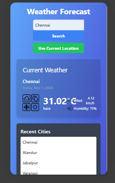

# Weather Forecast Application ☁️

## Overview 🌍
The Weather Forecast Application provides users with accurate and up-to-date weather information for various locations. Utilizing the OpenWeather API, the app displays a 5-day weather forecast, including temperature, humidity, wind speed, and air quality. The application features a user-friendly interface designed with Tailwind CSS, making it visually appealing and easy to navigate.

## Developed by Dinesh
For any queries, contact me at: [dinesh.suresh2001@gmail.com](mailto:dinesh.suresh2001@gmail.com)

---

## Table of Contents
- **Overview**
- **Technologies Used**
- **Installation**
- **Usage**
- **Configuration**
- **Screenshots**
- **License**
- **Contributing**
- **Acknowledgements**

---

## Technologies Used 🛠️
- HTML
- CSS (Tailwind CSS)
- JavaScript
- OpenWeather API
- Local Storage

---

## Installation 📦

### Step 1: Clone the Repository
Clone the repository to your local machine using the following command:
```bash
git clone https://github.com/yourusername/weather-forecast-app.git
```
(Replace `yourusername` with your actual GitHub username.)

### Step 2: Navigate to the Project Directory
Change to the project directory:
```bash
cd weather-forecast-app
```

### Step 3: Install Tailwind CSS
1. **Set Up Node.js**:
   - Ensure you have Node.js installed on your machine. If not, download and install it from [Node.js](https://nodejs.org/).

2. **Initialize npm**:
   - Run the following command to create a `package.json` file:
   ```bash
   npm init -y
   ```

3. **Install Tailwind CSS**:
   - Run the following command to install Tailwind CSS via npm:
   ```bash
   npm install -D tailwindcss
   ```

4. **Create Configuration Files**:
   - Generate the Tailwind CSS configuration files using:
   ```bash
   npx tailwindcss init
   ```

5. **Set Up Your CSS**:
   - Create a `src` directory and a `styles.css` file inside it.
   - Add the following lines to your `styles.css` file:
   ```css
   @tailwind base;
   @tailwind components;
   @tailwind utilities;
   ```

6. **Build Tailwind CSS**:
   - To build your CSS file, add a build script to your `package.json` file:
   ```json
   "scripts": {
     "build": "tailwindcss build src/styles.css -o dist/styles.css"
   }
   ```
   - Run the build command:
   ```bash
   npm run build
   ```

### Step 4: Obtain Your OpenWeather API Key
1. **Sign Up**:
   - Go to [OpenWeather](https://openweathermap.org/api) and sign up for an account.

2. **Get Your API Key**:
   - After logging in, navigate to the API section and find your API key. Copy it for later use.

### Step 5: Replace the API Key in Your Code
1. **Open the JavaScript File**:
   - Open the `script.js` file in your code editor.

2. **Replace the Placeholder**:
   - Find the line where it mentions `YOUR_API_KEY` and replace it with your actual OpenWeather API key.

### Step 6: Open the Application
Open the `index.html` file in your preferred web browser.

---

## Usage 🚀
- Enter a city name in the search bar and press enter or click the search button to view the weather forecast.
- The app will display a 5-day forecast along with temperature, humidity, wind speed, and air quality.

---

## Configuration ⚙️
1. **Update API Key**:
   - Open the `script.js` file.
   - Ensure that your OpenWeather API key is correctly placed.

2. **Customize Styles**:
   - Modify the CSS files in the `css` directory for your preferred styling.

---


## Screenshots 📸


### Complete README with Titles Only

Here’s how the entire README would look with the simplified image titles:

---

# Weather Forecast Application ☁️

## Overview 🌍
The Weather Forecast Application provides users with accurate and up-to-date weather information for various locations. Utilizing the OpenWeather API, the app displays a 5-day weather forecast, including temperature, humidity, wind speed, and air quality. The application features a user-friendly interface designed with Tailwind CSS, making it visually appealing and easy to navigate.

## Developed by Dinesh
For any queries, contact me at: [dinesh.suresh2001@gmail.com](mailto:dinesh.suresh2001@gmail.com)

---

## Table of Contents
- **Overview**
- **Technologies Used**
- **Installation**
- **Usage**
- **Configuration**
- **Screenshots**
- **License**
- **Contributing**
- **Acknowledgements**

---

## Technologies Used 🛠️
- HTML
- CSS (Tailwind CSS)
- JavaScript
- OpenWeather API
- Local Storage

---

## Installation 📦

### Step 1: Clone the Repository
Clone the repository to your local machine using the following command:
```bash
git clone https://github.com/yourusername/weather-forecast-app.git
```
(Replace `yourusername` with your actual GitHub username.)

### Step 2: Navigate to the Project Directory
Change to the project directory:
```bash
cd weather-forecast-app
```

### Step 3: Install Tailwind CSS
1. **Set Up Node.js**:
   - Ensure you have Node.js installed on your machine. If not, download and install it from [Node.js](https://nodejs.org/).

2. **Initialize npm**:
   - Run the following command to create a `package.json` file:
   ```bash
   npm init -y
   ```

3. **Install Tailwind CSS**:
   - Run the following command to install Tailwind CSS via npm:
   ```bash
   npm install -D tailwindcss
   ```

4. **Create Configuration Files**:
   - Generate the Tailwind CSS configuration files using:
   ```bash
   npx tailwindcss init
   ```

5. **Set Up Your CSS**:
   - Create a `src` directory and a `styles.css` file inside it.
   - Add the following lines to your `styles.css` file:
   ```css
   @tailwind base;
   @tailwind components;
   @tailwind utilities;
   ```

6. **Build Tailwind CSS**:
   - To build your CSS file, add a build script to your `package.json` file:
   ```json
   "scripts": {
     "build": "tailwindcss build src/styles.css -o dist/styles.css"
   }
   ```
   - Run the build command:
   ```bash
   npm run build
   ```

### Step 4: Obtain Your OpenWeather API Key
1. **Sign Up**:
   - Go to [OpenWeather](https://openweathermap.org/api) and sign up for an account.

2. **Get Your API Key**:
   - After logging in, navigate to the API section and find your API key. Copy it for later use.

### Step 5: Replace the API Key in Your Code
1. **Open the JavaScript File**:
   - Open the `script.js` file in your code editor.

2. **Replace the Placeholder**:
   - Find the line where it mentions `YOUR_API_KEY` and replace it with your actual OpenWeather API key.

### Step 6: Open the Application
Open the `index.html` file in your preferred web browser.

---

## Usage 🚀
- Enter a city name in the search bar and press enter or click the search button to view the weather forecast.
- The app will display a 5-day forecast along with temperature, humidity, wind speed, and air quality.

---

## Configuration ⚙️
1. **Update API Key**:
   - Open the `script.js` file.
   - Ensure that your OpenWeather API key is correctly placed.

2. **Customize Styles**:
   - Modify the CSS files in the `css` directory for your preferred styling.

---

## Screenshots 📸
  
*Searching City Name*

  
*Invalid City Name*

  
*Responsive - iPhone SE*

  
*Responsive - iPhone SE (alternative)*

---

## License 📝
This project is licensed under the MIT License.  
**Owner**: Dinesh (master-dinesh)

---

## Contributing 🤝
Please do not copy the code. If you wish to collaborate, feel free to reach out!  
If you find this project useful, please give it a star ⭐ on GitHub!

I have worked hard to configure this application, and I kindly ask that you do not steal the work of others.

---

## Acknowledgements 🙏
Thank you for visiting my repository! I hope you find the application useful. If you have any feedback or suggestions, feel free to contact me.

---

Feel free to make any further adjustments as needed! If you have more requests or questions, just let me know!
---

## License 📝
This project is licensed under the MIT License.  
**Owner**: Dinesh (master-dinesh)

---

## Contributing 🤝
Please do not copy the code. If you wish to collaborate, feel free to reach out!  
If you find this project useful, please give it a star ⭐ on GitHub!

I have worked hard to configure this application, and I kindly ask that you do not steal the work of others.

---

## Acknowledgements 🙏
Thank you for visiting my repository! I hope you find the application useful. If you have any feedback or suggestions, feel free to contact me.

---

Feel free to customize any part of this README as needed! Let me know if you have any other requests or changes.
